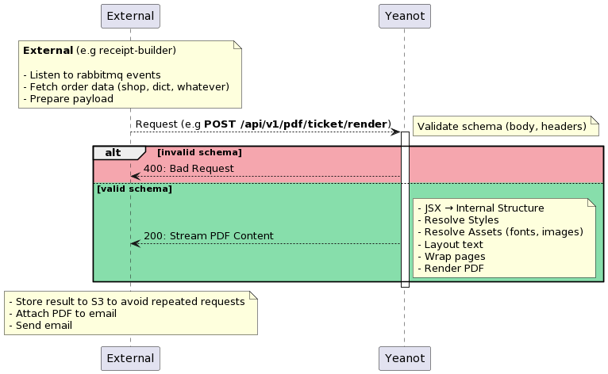

# Yeanot


> **Ye**t **A**nother **Not**ification (Builder)
> https://en.wikipedia.org/wiki/Yet_another

## Table of contents

- [Description](#description)
- [Installation](#installation)
- [References](#references)
- [Troubleshooting](#troubleshooting)
- [Deploy](#deploy)
- [Sentry](#sentry)

## Description

Сервис для рендеринга HTML писем и PDF (`react-pdf`) маршрут квитанций.

Сервис получает запрос с данными в виде `JSON` и возвращает PDF файл или HTML письма

**Что этот сервис не делает?**

- Не отправляет письма и PDF файлы
- Не сохраняет PDF на S3

### Example

> Ссылку можно декодировать через [PlantUML online server](https://www.plantuml.com/plantuml/uml/)
>
> - [ссылка на картинку](//www.plantuml.com/plantuml/png/ZLBBZXCn4BpxAqhQIp9AoF96EQ1T7Yk1LYBQ81x7phYIiPWPpzezm-O7-00-aI_1LYP1h3XmiThjgkfogI-YIj2-gKthbV030zxUAKChjG6AudWf2apuO8V0agxJ-QPtjMMO6WFCSUsYieLw1Dbid3QtuC1MOtx55RMiu4F2mueA9h7otGpMbJh3zqgKGvRAs5LW9u7eP5zxiOQjHRPcpD49vlEN-4f9tILkUDipwi5RKQm-h3zY8PrR30yNdTqkr9NVg8kGP1YAOcgaL3U8SbGuV3kuNQK6-2Iri_anbXKRmMJZxNw6YfBOSVh7ZDIAi-rJUIQ4QuTC6pa6etAsUOfoYIVdvqky4djqR5X7ukp5SqlPu7yK7cM5jGPAWzMRAxpshRBDjl_wGmxn_VeBVltuYNVjWPnfVQbzu0YuOVJrmDJVruptcfSnKYCcspGWpk0QsJ5EHz2rx7slKDuTXtqEqg7Bc9DE3ZjxDC0fibGOo_ln_tljvbYh3qHWx6k5UgmVvrC6xom2Eueo5pdASSakLQMiyjICP2DkL4g3n-l9oqMgqix_1W00)



## Installation

Если вам в этой жизни повезло и у вас есть нода, то для разработки достаточно

1. Иметь актуальную версию **Node.JS**. Смотреть в `package.json#engines.node`
2. Установить зависимости `npm i`
3. Запустить дев сервер `npm run dev`

А если вам не повезло, но вы хотите "просто посмотреть"

1. Идем за `NPM_TOKEN` [сюда](https://wiki.yandex.ru/homepage/frontend/packages/)
2. Билдим и запускаем

```sh
docker-compose up
```

## References

> API Docs: [https://yeanot-staging-platform.dev.cloud.
> aviata.team/api/docs](https://yeanot-staging-platform.dev.cloud.aviata.team/api/docs)

**Документация**

- [react-pdf](https://react-pdf.org/)
- [fastify](https://www.fastify.io/)

**Адрес сервиса**

- [staging - https://yeanot-staging-platform.dev.cloud.aviata.team](https://yeanot-staging-platform.dev.cloud.aviata.team)
- [production | http://yeanot:8000 (внутри `platform` namespace)](http://yeanot:8000)

**Sentry**

- [staging](https://sentry.dev.k8s.aviata.team/organizations/sentry/projects/yeanot)
- [production](https://sentry.aviata.team/sentry/yeanot/)

**Logs**

- [staging](<https://elasticstack.dev.aviata.team/app/discover#/?_g=(filters:!(),refreshInterval:(pause:!t,value:0),time:(from:now-15m,to:now))&_a=(columns:!(message),filters:!(),index:f4477720-3266-11ec-8011-910815cfd0d7,interval:auto,query:(language:kuery,query:'kubernetes.deployment.name.keyword%20:%20%22yeanot-deployment%22%20'),sort:!(!('@timestamp',desc)))>)
- [production](<https://logs.aviata.team/app/discover#/?_g=(filters:!(),refreshInterval:(pause:!t,value:0),time:(from:now-1h,to:now))&_a=(columns:!(message),filters:!(('$state':(store:appState),meta:(alias:!n,disabled:!f,index:'82de5e80-1b8e-11ec-a0db-1f3dbacb06dc',key:tags,negate:!f,params:(query:beats-input),type:phrase),query:(match_phrase:(tags:beats-input))),('$state':(store:appState),meta:(alias:!n,disabled:!f,index:'82de5e80-1b8e-11ec-a0db-1f3dbacb06dc',key:kubernetes.deployment.name.keyword,negate:!f,params:(query:yeanot-deployment),type:phrase),query:(match_phrase:(kubernetes.deployment.name.keyword:yeanot-deployment)))),index:'82de5e80-1b8e-11ec-a0db-1f3dbacb06dc',interval:auto,query:(language:kuery,query:''),sort:!(!('@timestamp',desc)))>)

**Grafana**

- [**Graphite метрики**](https://grafana.aviata.team/d/xFYFHcsZk/graphite-services-metrics?orgId=1&var-service=yeanot&from=now-1h&to=now)
- **Deployment**
  - [staging](https://grafana.aviata.team/d/ORYiYUzmk/deployments?orgId=1&var-datasource=Developers%20Prometheus&var-deployment_namespace=staging-platform&var-deployment_name=yeanot-deployment)
  - [production](https://grafana.aviata.team/d/ORYiYUzmk/deployments?orgId=1&var-datasource=Platform%20Prometheus&var-deployment_namespace=platform&var-deployment_name=yeanot-deployment)

**Debug**

- REPL для интерактивного дебага верстки PDF

  - [react-pdf-repl GitHub](https://github.com/jeetiss/react-pdf-repl)
  - [react-pdf-repl](https://react-pdf-repl.vercel.app/)

**Шрифты**

- Для скачивания шрифтов с определенным набором символов (latin, cyrillic) можно использовать [google-webfonts-helper](https://gwfh.mranftl.com)

## Troubleshooting

### Текст выходит за границу родительского блока

**Issue:** https://github.com/diegomura/react-pdf/issues/2182

Варианты решений:

1. `width: 100%` - `<Text style={{ width: '100%' }}>...</Text>`. Используется в проекте
2. `flexGrow: 1, flexBasis: 0` - https://github.com/diegomura/react-pdf/issues/2182#issuecomment-1420303242

## Deploy

- **staging** - мердж в `develop`
- **production** - tag от мастер, e.g `2023.1.0`. Формат: `YEAR.MINOR.PATCH`

## Sentry

### 1. Поиск события рендера маршрутки

Находим лог. Ссылка на логи находится выше ([References](#references))

Пример запроса на стейджинге

```
kubernetes.deployment.name.keyword : "yeanot-deployment"  and AVX69MSX
```

Нашли

```json
{
  "level": 30,
  "time": 1690172099636,
  "pid": 1,
  "hostname": "yeanot-deployment-5d969fd7f6-l5pcj",
  "reqId": "b54bde8f-92c7-4102-aa74-7b451cc0792c",
  "sentry_event_id": "58a721089d9a41938e8371498f10ecae",
  "order_number": "AVX69MSX",
  "msg": "render pdf ticket"
}
```

Берем **sentry_event_id** (`58a721089d9a41938e8371498f10ecae`)

#### 2. Далее нужно получить API токен для sentry (если его еще нету)

- **staging:** https://sentry.dev.k8s.aviata.team/settings/account/api/auth-tokens/
- **production:** https://sentry.aviata.team/api/

Указываем `scope`

- `project:read`

#### 3. Далее можно запросить данные события через Sentry API

- **staging:** `https://sentry.dev.k8s.aviata.team/api/0/projects/sentry/yeanot/events/{{ EVENT_ID }}/`
- **production:** `https://sentry.aviata.team/api/0/projects/sentry/yeanot/events/{{ EVENT_ID }}/`

Пример:

```sh
curl -H "Authorization: Bearer {{ AUTH_TOKEN }}" https://sentry.dev.k8s.aviata.team/api/0/projects/sentry/yeanot/events/58a721089d9a41938e8371498f10ecae/
```
